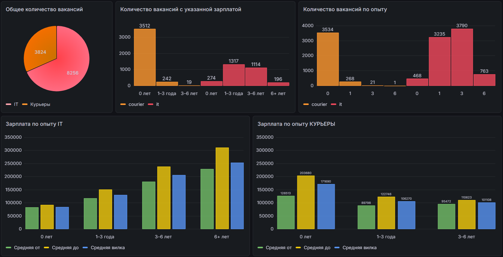
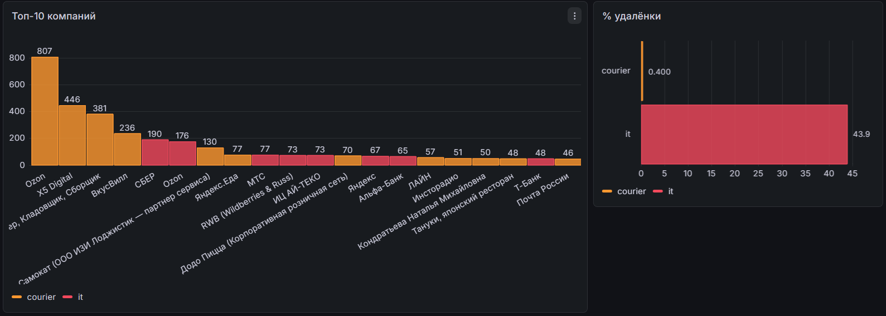

# HH Vacancies Analyzer

Анализ рынка труда в Москве: IT-специальности vs курьеры (на основе API hh.ru)

### Что уже сделано
- Собрано **12 000+ вакансий** (8 256 IT + 3 824 курьеры) за февраль 2026
- Автоматизирован ежедневный сбор через публичный API hh.ru
- Предварительный анализ публичных данных:
  - Удалёнка: **44 %** в IT vs **0.4 %** у курьеров
  - Зарплата указана: **35 %** в IT vs **99 %** у курьеров
  - Опыт: **92 %** курьеров — без опыта, IT — мидлы (1–6 лет)
  - Топ-компании: Ozon лидирует в обеих категориях
- Построен интерактивный дашборд в **Grafana** (снапшот доступен здесь: https://snapshots.raintank.io/dashboard/snapshot/lKRjPg5Wbpt972npwasPRiPtTcXwCWwv)

### Технологии
- Python (requests, pandas, matplotlib, wordcloud)
- SQLite / PostgreSQL для хранения
- Grafana для визуализации
- Airflow (в планах для ежедневного запуска)

### Скриншоты дашборда

